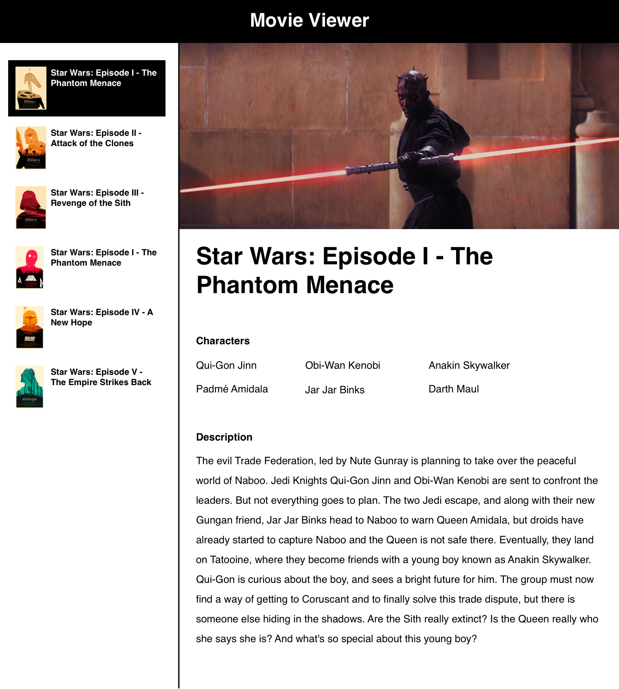

# React Movie Viewer

Build a movie details viewer using React and React Router

## Prerequisites

* React
* Create-react-app
* React Router

## Instructions

Create a react app in this directory (`lib/movie-viewer`) using
`create-react-app`. Then follow the requirements below.

## Requirements

Using React and React Router, build a simple website showcasing the details for
all the Star Wars Movies. Your app will have a sidebar, listing all the Star Wars
movies and linking to a show page in the main section of the page. When a user
clicks on a movie from the sidebar list, they should see the details for that
movie rendered in the main content area of the page. Use the data provided in
[`data.json`](./data.json).

## Plagiarism

Take a moment to refamiliarize yourself with the [Plagiarism policy](https://git.generalassemb.ly/DC-WDI/Administrative/blob/master/plagiarism.md). Plagiarized work will not be accepted.

## [License](LICENSE)

1.  All content is licensed under a CC­BY­NC­SA 4.0 license.
1.  All software code is licensed under GNU GPLv3. For commercial use or
    alternative licensing, please contact legal@ga.co.
