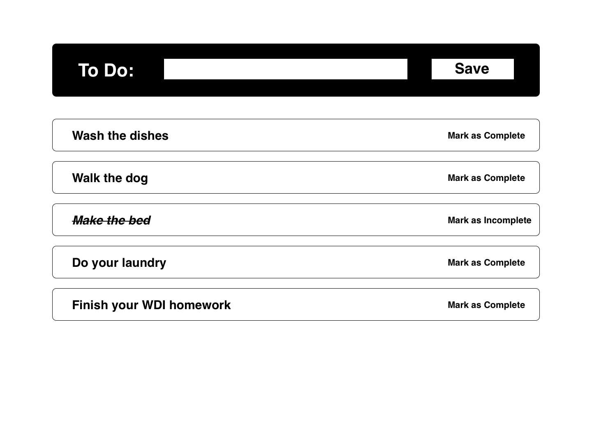

[](https://generalassemb.ly/education/web-development-immersive)

# React To Do

Practice working with state by building a simple to do list.

## Prerequisites

* React
* State and props
* Create-react-app

## Instructions

Create a react app in this directory (`lib/todo`) using `create-react-app`. Then
follow the requirements below.

## Requirements

For this exercise, you're going to build a to do list to practice working with
state, props, and forms:



Your app should have the following components:

* App - container component for entire application (all state and callbacks
    should be here)
  * ToDoForm - for creating new to dos, should invoke a callback passed in as
      a prop to update state in App
  * ToDoList - container component for to dos, should receive list of to dos from
      App component's state
    * ToDoItem - component for single to do; your app should render one of these
        components for each item in the App component's state.

This is to practice working with state, passing state as props, and updating
state with callbacks. For this application, you only need to have application
state in your App component.

Your state will look like this:

```js
[
  {
    title: "Wash the dishes",
    complete: false
  },
  {
    title: "Walk the dog",
    complete: false
  },
  {
    title: "Make the bed",
    complete: true
  },
]
```

When someone submits the form to add a to do item, it should save the to do to
state in the App component. Because you're using a form here, the ToDoForm
component will need state so your input is a controlled component.

> What's a controlled component? What is application state versus form state?

When someone clicks the "Mark as Complete" link, that item should update so the
`complete` property for that to do is `true`; when the user clicks "Mark as
Incomplete", it should update so that property is `false.`

## Plagiarism

Take a moment to refamiliarize yourself with the [Plagiarism policy](https://git.generalassemb.ly/DC-WDI/Administrative/blob/master/plagiarism.md). Plagiarized work will not be accepted.

## [License](LICENSE)

1.  All content is licensed under a CC­BY­NC­SA 4.0 license.
1.  All software code is licensed under GNU GPLv3. For commercial use or
    alternative licensing, please contact legal@ga.co.
